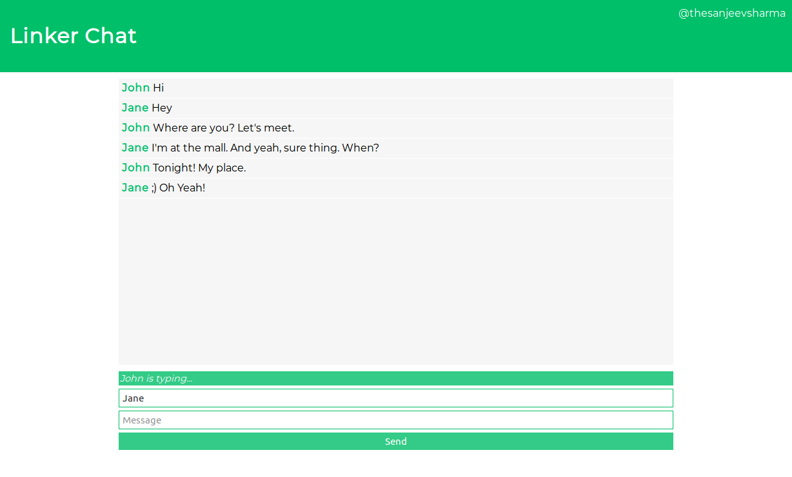

# Linker Chat

Chat app made with Sockets.IO based in Node + Express.

### Screenshot

### How to run the app?

1. Clone the repo `git clone https://github.com/thesanjeevsharma/linker-chat-app.git`.
2. In the root directory of the project, run `npm install`.
3. Run `npm start`.
4. Visit `http://localhost:4000`.